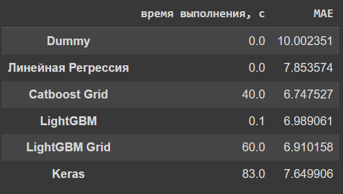

# Предсказание температуры стали металлургического комбината
Задачей проекта является оптимизация производственных расходов металлургического комбината ООО «Так закаляем сталь».  
Руководство завода решило уменьшить потребление электроэнергии на этапе обработки стали.  
В проекте построена модель, которая предскажет температуру стали.  

# Целевые метрики: 
MAE > 8.7 — 0 sp  
7.6 < MAE ≤ 8.7 — 4 sp  
6.8 < MAE ≤ 7.6 — 4.5 sp  
6.3 < MAE ≤ 6.8 — 5 sp  
6.0 < MAE ≤ 6.3 — 5.5 sp  
MAE ≤ 6.0 — 6 sp  
(sp - баллы за правильность предсказаний)

# Выполнение проекта
* произведен анализ исходных данных
* произведена обработка
* построены таблицы визуализации
* добавлены дополнительные параметры
* произведена проверка на мультиколлениарность признаков
* обучено несколько моделей для предсказания температуры (Dummy-модель, линейная регрессия, CatBoost, LGBoost, Keras
* рассчитана важность признаков лучшей модели
* представлен отчет о результатах

# Итоговая таблица моделей и выводы:
  
* Наиболее важными метриками являются работа при нагреве стали, начальная температура и добавление проволочных материалов.
* Наиболее точной моделью является Catboost с подбором параметров с МАЕ=6.74, наиболее быстрой LightGBM с временем обучения 0.1 с.
